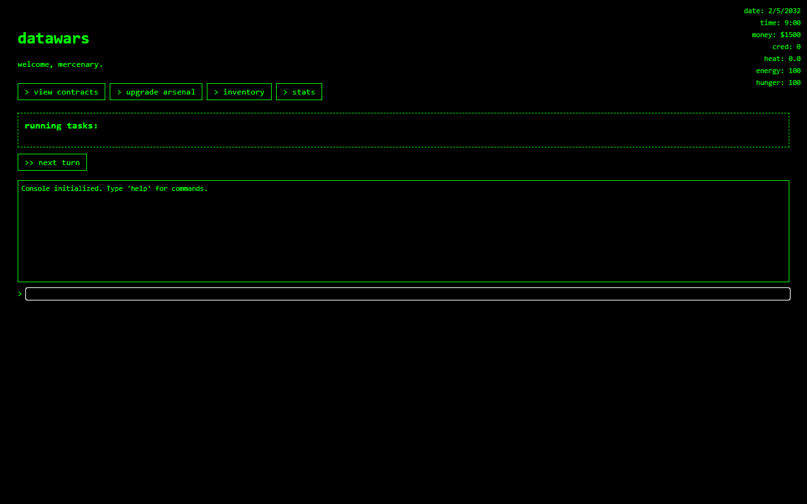

# datawars

`modern BBS dystopia sim`

complete contracts, upgrade your arsenal, manage resources



## current state

public dev snapshot. playable loop exists, content thin.

## install / run

```sh
git clone https://github.com/dandebar/datawars.git
cd datawars
python -m http.server 4173 --directory sp
```

open `http://127.0.0.1:4173/`

no build step, no install step.

## core game mechanics

- mission selection and task execution
- applying tool effects to missions
- calculating mission success and failure
- awarding rewards and applying penalties
- managing the game's economy and player progression
- procedural contracts, factions and storyline

## roadmap

### 0.0.2

- more contracts
- more items to buy and earn
- more stat and tool effects
- tighten the core loop
- test the split `sp/` module structure

### 0.1

- story / intro pass
- friendly NPC foundation
- hostile NPCs
- combat / defense system
- home customization
