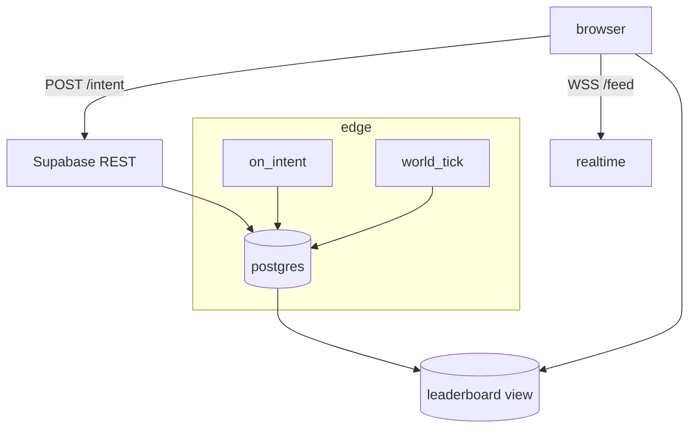

# !!
this is wip and under constant changes

# datawars-online  
*modern bbs dystopia sim — shared-universe shard*

## files
```
/
├─ docs/
├─ sp/              # solo client
│   └─ ...          # index.html...
└─ mp/
    ├─ client/      # online ui (pwa)
    └─ server/      # edge fns + sql + migrations
```

## gameplay loop

1. pick contract → slot tools/cards  
2. **submit intent** → wait next world-tick (5 min)  
3. rewards / heat / cred roll in  
4. climb leaderboard or tank the economy  


## roadmap

- [ ] rotating contract board (tick + daily)  
- [ ] npc black-market (fixed store)  
- [ ] global leaderboard (cash • cred • heat)  
- [ ] player auction house  
- [ ] ghost-raid pvp  
- [ ] factions & territory heat  
- [ ] story arcs & timed events  

## stack

| layer    | pick                                   | why                            |
|----------|----------------------------------------|--------------------------------|
| ui       | **vanilla js** + lit-html (mp/client)  | featherweight, runs everywhere |
| backend  | **supabase** (pg + edge functions)     | free ≤ 10 k players            |
| realtime | supabase realtime (wss)                | feed + countdown               |
| cron     | scheduled edge fn                      | world-tick every 5 min         |
| deploy   | vercel (static)                        | git push → prod                |

zero vms. zero infra bill until people care.

## data model

```sql
players   (id uuid pk, state jsonb, money int, cred int, heat int)
contracts (id int pk, body jsonb, tick_valid int)
intents   (id serial pk, player uuid, contract int, payload jsonb, ts timestamptz)
events    (id serial pk, msg text, ts timestamptz)
meta      (id int pk default 1, tick int, next_ts timestamptz)
```

## edge functions (mp/server)

`on_intent.ts`

```ts
assertSig(payload)              // sha1 guard
calcOutcome(contract, deck)     // deterministic roll
updateDB(player, rewards)       // trx: players • events • leaderboard
return result
```

`world_tick.ts` (cron: \*/5 min)

```ts
if Date.now() >= meta.next_ts {
  rotateContracts()
  payInterest()
  meta.tick++
  meta.next_ts += 300_000
}
```

## mermaid view



## local

```bash
git clone https://github.com/you/datawars
cd datawars
pnpm i

# single-player sandbox
pnpm --filter sp dev

# online shard
supabase start                 # local db + edge emulator
supabase functions serve &     # watch edge fns
pnpm --filter mp/client dev    # hot reload ui
```

`cp .env.example .env` and fill:

```
SUPABASE_URL=http://localhost:54321
SUPABASE_ANON_KEY=...
```

## deploy prod

```bash
supabase db push                 # run migrations
supabase functions deploy        # on_intent + world_tick
vercel --cwd mp/client --prod    # static ui
```

---

pull requests, bug reports & contract ideas welcome.